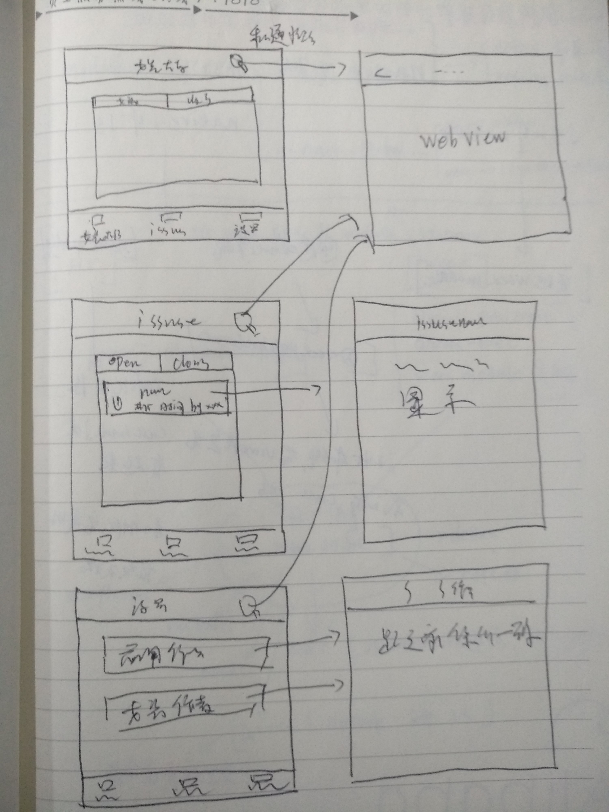

# 应用设计文档

这份文档是整个应用的设计，包含了如下几个部分：

- 使用的 API 梳理
- 手绘的UI和交互设计
- 实现的技术特点

## 使用的 API 梳理

针对这个应用将要使用的 API 做一个梳理

- 资源仓库：[https://github.com/komeiji-satori/Dress](https://github.com/komeiji-satori/Dress)
- 获取作者API：[https://api.github.com/users/komeiji-satori](https://api.github.com/users/komeiji-satori)
- 获取仓库API：[https://api.github.com/repos/komeiji-satori/Dress](https://api.github.com/repos/komeiji-satori/Dress)
- gh-pages branch API：[https://api.github.com/repos/komeiji-satori/Dress/branches/gh-pages](https://api.github.com/repos/komeiji-satori/Dress/branches/gh-pages)
- 获取仓库下的内容：[https://api.github.com/repos/komeiji-satori/Dress/contents/](https://api.github.com/repos/komeiji-satori/Dress/contents/)
- 获取具体的文件：[https://api.github.com/repos/komeiji-satori/Dress/contents/447f.Misaka](https://api.github.com/repos/komeiji-satori/Dress/contents/447f.Misaka)

## 手绘的UI和交互设计

- 主体颜色：rgb(245, 208, 56) #F5D038
- 主体字体颜色：#fff

## 实现的技术特点

- 利用 Bloc 来管理数据和更新 UI
- 可能会使用到多个 Widget 的组合来实现 UI
- Native 平台相关的特性展示
- 通过网络获取数据源
- 对数据的清洗上设计合理的模式
- 可能会添加一个 md 解析器
- [https://pub.dartlang.org/packages/shared_preferences](https://pub.dartlang.org/packages/shared_preferences) 存储作者数据 和 图片地址数据